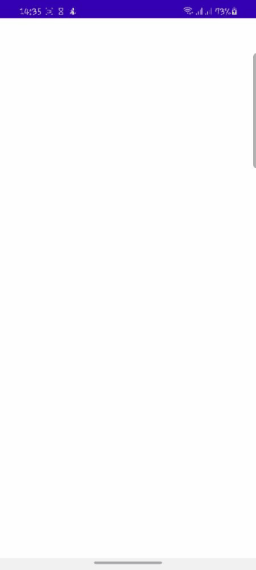

# UserList

A simple app that displays list of users from [https://dummyapi.io/](https://dummyapi.io/) 

## Architecture

This uses a modified version of **clean architecture(Layered)**

**Domain**: provides an interface for cache and remote layer and also provides use cases for the app module to consume 

**Cache**: This one part of the data manipulation layer, contains implementations for interfaces provided by the domain layer, this layer main handles database and preference operations 

**Remote**: This is the second part of the data manipulation layer, it contains remote interface implementations provided by the domainn layer, this layer handle all network related operations.

**App**: UI module of this application, it contains Viewmodels, Activities and Fragments

## Libraries

- Dependency injection: [Dagger Hilt](https://dagger.dev/hilt/)
- Design system: [Material design](https://material.io/design)
- CI: [circle ci](https://circleci.com/) ,To run unit tests and check code quality
- Code quality and linting: [ktlint](https://github.com/pinterest/ktlint) and [spotless](https://github.com/diffplug/spotless)
- Data: [Datastore](https://developer.android.com/topic/libraries/architecture/datastore), [Room](https://developer.android.com/training/data-storage/room)
- Networking: [Retrofit](https://square.github.io/retrofit/)
- Navigation: [Navigation component](https://developer.android.com/guide/navigation/navigation-getting-started)
- Testing: [Mockk](https://mockk.io/), [Truth](https://truth.dev/), [konveryor](https://github.com/Vacxe/Konveyor), [espresso](https://developer.android.com/training/testing/espresso), ..